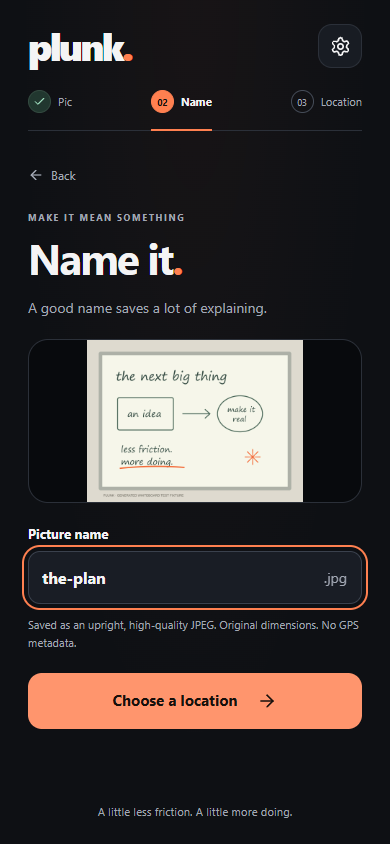
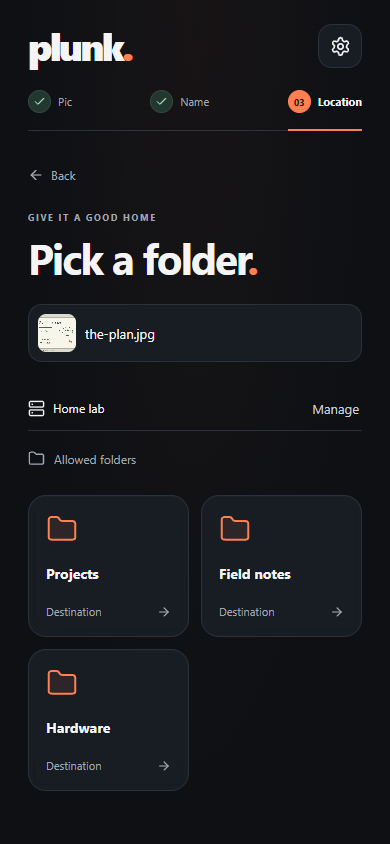
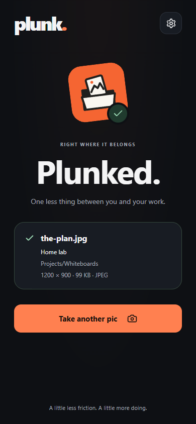

<p align="center"></p>

<p align="center">
  <a href="https://github.com/bx0-val/plunk/actions/workflows/ci.yml"></a>
  <br><br>
  <a href="docs/setup.md"><strong>Set up Plunk</strong></a> ·
  <a href="#see-it-work">See it work</a> ·
  <a href="docs/development.md">Build & contribute</a>
</p>

Take a pic. Name it. Pick a folder. **Straight from your iPhone to your Linux server.**

The whiteboard, the handwritten idea, the hardware on your desk. Plunk turns “here, look” into a JPEG in your project folder, ready for whatever comes next. Your model tooling decides how to use it.

## Small enough to become a habit

- **Pic → Name → Location.** Camera or photo library, a name you choose, a grid of folders. One server saved? Go straight to its folders.
- **Made for your Home Screen.** A dark interface, warm orange actions, remembered destinations, and a receipt when the server confirms the save.
- **Your folders, on your terms.** Run `plunk here` in a project. It becomes a destination immediately.
- **Direct to the listener.** No central image storage, account platform, or analytics. Each server controls its own authentication and allowed folders.
- **Files your tools can use.** Upright RGB JPEGs at quality 95, with original dimensions and EXIF removed. Existing files are never overwritten.

## Start on your Linux server

Already using Tailscale? You need **Python 3.12+, Node 22+ with Corepack, Git, and a systemd user session**. Keep your iPhone on the same tailnet. The [step-by-step guide](docs/setup.md) covers prerequisites, private-repository access, and troubleshooting.

```bash
git clone https://github.com/bx0-val/plunk.git
cd plunk
./scripts/plunk.py install
```

The installer builds the app, starts the listener, configures Tailscale HTTPS on a free port, and shows a QR code and a one-time pairing code. Add Plunk to your iPhone Home Screen, open it from the icon, and connect with the code.

Then make it part of your work:

```bash
cd ~/projects/robot
plunk here --name Robot

plunk pair       # Connect a phone
plunk ls         # See your destinations and their IDs
plunk status     # Check the listener and app address
```

The terminal uses color automatically, respects `NO_COLOR`, and supports `--color always|never|auto`. `plunk url` stays plain for scripts. Prefer containers? Use the [Docker guide](docs/docker.md).

## See it work

<p align="center">
  
  
  
</p>

Actual app screens from a desktop browser at phone size, connected to a Linux listener in WSL. The whiteboard is a generated test image. [Watch the local upload recording](public/launch/plunk-demo.mp4). Physical iPhone Safari/Home Screen and remote Tailscale checks must still be performed on your devices.

## Good to know

Keep Plunk open while uploading. There is no background queue in v1; reloading closes the unsent picture. Recoverable errors keep the current picture and name, and retries reuse a request ID to avoid a second save.

Saved server credentials live in the browser profile. Pairing is single use and expires after ten minutes. For additional listeners, configure the installed app’s origin and add the server by address. Bearer tokens, HTTP Basic, and no authentication are supported. [Setup and multi-server instructions →](docs/setup.md)

| Looking for… | Go here |
| --- | --- |
| First install, pairing, destinations, updates | [Setup guide](docs/setup.md) |
| Containers or public-domain HTTPS | [Docker guide](docs/docker.md) |
| API, limits, filesystem guarantees | [Listener reference](docs/reference.md) |
| Local development and tests | [Development](docs/development.md) |
| What has actually been checked | [Verification record](docs/verification.md) |
| Identity and launch materials | [Brand](docs/brand.md) · [Launch kit](docs/launch-kit.md) |

Plunk is a working name; name, domain, and trademark availability have not been cleared for public release.
